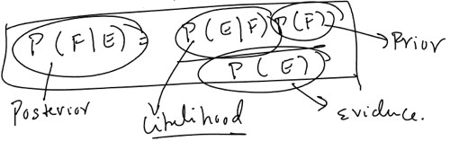

```{r setup, include=FALSE, echo=FALSE}
knitr::opts_chunk$set(
  # collapse = TRUE
  warning = FALSE,
  message = FALSE,
  comment = "",
  cache = TRUE
)
# libraries
library(tidyverse)
```


# Classification

**Learning objectives:**

- Learn how text can be used in a classification model  
- Learn how to tune hyperparameters of a model  
- Learn how to compare different model types  
- Understand that models can combine textual and non-textual predictors  
- Learn about engineering custom features for ML  
- Learn the performance metrics for classification models  

## Classification - What's that?

> Predict a class label or group membership  


### The Data

*The Consumer Complaint Database* : financial product and service complaints  

```{r 0-data, echo=FALSE}
# can be downloaded here: https://www.consumerfinance.gov/data-research/consumer-complaints/
# warning: it is a large file (~1.5GB)
complaints <- read_csv("data/complaints.csv")
glimpse(complaints)

# vars in the data used by the book are all lower case vs raw data pull 3/2/22
complaints <- janitor::clean_names(complaints)
```
- note: since this chapter was written, the number of observation rose from ~117K to ~2.5M so the outputs may differ

## First Classification Model

- **Goal**: predict if a complaint is referring to credit reporting, credit repair services, or other personal reports
- **Outcome**: `product`: transformed into a binary var with levels `{Credit, Other}`  
- **Explanatory**: `consumer_complaint_narrative`

First step: understand the structure of the narrative as it will be used to predict the type of complaint. This variable will likely need some pre-processing but at the moment we will start simple.  

```{r 1-view-narrative}
head(complaints$consumer_complaint_narrative)
```

*Notice the frequency of strings containing 'Xs (to protect private information) and that prices are surrounded by `{}`*

### LET'S START MODELING!

```{r 1-model}
library(tidymodels)

set.seed(1234)
# Re-factor product into a binary variable
complaints2class <- complaints %>%
  mutate(product = factor(if_else(
    product == "Credit reporting, credit repair services, or other personal consumer reports",
    "Credit", "Other"
  )))
# for the sake of simplicity - removing any complaints with na
complaints2class <- complaints2class %>% 
  drop_na(consumer_complaint_narrative)
# 2.5M -> 877K

# create a single binary split of data
complaints_split <- initial_split(complaints2class, strata = product)

complaints_train <- training(complaints_split)
complaints_test <- testing(complaints_split)
```

Check the dims of the test and training data:

```{r 1-dims}
dim(complaints_train)

dim(complaints_test)

# we can observe at 25/75 split
```

### Pre-processing with `{textrecipes}`

This includes tokenizing the narrative (tokens are words by default), filter the number of tokens based on frequency, and computing the tf-idf

```{r 1-preproc}
rm(complaints)
library(textrecipes)

complaints_rec <-
  # initiate the recipe
  recipe(product ~ consumer_complaint_narrative, data = complaints_train) %>% 
  # tokenize the narrative
  step_tokenize(consumer_complaint_narrative) %>%
  # filter the tokens based on the top 1000 most frequent
  step_tokenfilter(consumer_complaint_narrative, max_tokens = 1e3) %>%
  # calculate the tf-idf
  step_tfidf(consumer_complaint_narrative)

```

Next, build a `{tidymodels}` workflow to bundle the recipe together:

```{r 1-workflow}

complaint_wf <- workflow() %>%
  add_recipe(complaints_rec)

# save wf
# save(complaint_wf, file = "data/1-wf.rda")
# load("data/1-wf.rda")
```

For our first model, we will utilize *Naïve Bayes*. Why? 

### A Mini Primer on Naïve Bayes Classifier

> A classification technique based on Bayes' Theorem with an assumption of independence among predictors. This algorithm uses the probability of an event that has already occured to estimate the probability of an event occuring. 

Bayes Theorem: 



* can be thought of "reversing" conditional probabilities.  
  * when you need the probability of some event E conditional on event F but you only know the probability of F conditional on E occurring.  
* it is "naïve" because of the assumption that the *exact conditional probability* of a vector of predictors, given observing an outcome, is sufficiently well estimated by the *product* of the i*ndividual conditional probabilities*.  
   * in other words, we assume that each of the events in the feature vector are independent of each other
   
- A good simple [example](https://www.geeksforgeeks.org/naive-bayes-classifiers/)

Naïve Bayes is easy and fast to predict class of test data set. It also perform well in multi-class predictions! So, because we have a discrete feature vector, and we can assume that each complaint is independent, we can use *Naïve Bayes* to classify the complaints!  

### Set Engine

```{r 1-engine}
library(discrim)
nb_spec <- naive_Bayes() %>%
  set_mode("classification") %>%
  set_engine("naivebayes")

nb_spec
```

Now, we fit!

```{r 1-fit, eval=FALSE, include=TRUE}
nb_fit <- complaint_wf %>%
  add_model(nb_spec) %>%
  fit(data = complaints_train)
# WARNING this is >12GB
```


### Evaluate

**Create the folds:**

```{r 1-evaluate, eval=FALSE, include=TRUE}
set.seed(234)
# resample using k-folds (10)
complaints_folds <- vfold_cv(complaints_train)

save(complaints_folds,file = "data/complaints_folds.rda")
```


**Create the workflow:**

```{r 1-wf2}
nb_wf <- workflow() %>%
  add_recipe(complaints_rec) %>%
  add_model(nb_spec)

nb_wf
```

**Fit the model to the folds:**

```{r 1-fit2, eval=FALSE, include=TRUE}
# remove things taking up lots of memory
rm(complaints_split)
# load saved files
load("data/complaints_folds.rda")

nb_rs <- fit_resamples(
  nb_wf,
  complaints_folds,
  control = control_resamples(save_pred = TRUE)
)
```

**Get the performance metrics:**
```{r 1-performance}
nb_rs_metrics <- collect_metrics(nb_rs)
nb_rs_predictions <- collect_predictions(nb_rs)
```

**Visualize Performance:**

ROC Curve
```{r 1-roc}
nb_rs_predictions %>%
  group_by(id) %>%
  roc_curve(truth = product, .pred_Credit) %>%
  autoplot() +
  labs(
    color = NULL,
    title = "ROC curve for US Consumer Finance Complaints",
    subtitle = "Each resample fold is shown in a different color"
  )
```

Confusion Matrix

```{r 1-conf-matrix}
conf_mat_resampled(nb_rs, tidy = FALSE) %>%
  autoplot(type = "heatmap")
```

## Compare to Null

It is helpful to build a baseline, or null, model from which to compare. This model is simple, non-informative that always predicts the largest class. These are used as a simple heuristic to assess modeling effort.

```{r 2-null-model}
null_classification <- null_model() %>%
  set_engine("parsnip") %>%
  set_mode("classification")

null_rs <- workflow() %>%
  add_recipe(complaints_rec) %>%
  add_model(null_classification) %>%
  fit_resamples(
    complaints_folds
  )
```


**Collect Metrics**

```{r 2-performance}
null_rs %>%
  collect_metrics()
```


## Compare Lasso Classification Model

*What's lasso classification model?*  
It's a regularized linear model with variable selection.  

*What's a regularized linear model?*  
It's a type of linear regression where the coefficient estimates are constrained to zero.  
 
 

*..but why??*  
To reduce the risk of overfitting by discouraging a linear model from learning more complex model that is usually caused by noise.  


*So what?*  
Lasso regression can be useful in cutting down the many features (tokens). It helps us choose a simpler model by penalizing features so we select only some of the features out of the high-dimensional space of possible tokens. 


### Let's Lasso

```{r 3-spec}
lasso_spec <- logistic_reg(penalty = 0.01, mixture = 1) %>%
  set_mode("classification") %>%
  set_engine("glmnet")

lasso_spec
```


**Workflow**

```{r 3-wf}
lasso_wf <- workflow() %>%
  add_recipe(complaints_rec) %>%
  add_model(lasso_spec)

lasso_wf
```


**Fit**

```{r 3-fit}
set.seed(2020)
lasso_rs <- fit_resamples(
  lasso_wf,
  complaints_folds,
  control = control_resamples(save_pred = TRUE)
)
```

**Get Performance Metrics**

```{r 3-performance}
lasso_rs_metrics <- collect_metrics(lasso_rs)
lasso_rs_predictions <- collect_predictions(lasso_rs)
lasso_rs_metrics

```


This looks promising!

**Visualize**

```{r 3-roc}
lasso_rs_predictions %>%
  group_by(id) %>%
  roc_curve(truth = product, .pred_Credit) %>%
  autoplot() +
  labs(
    color = NULL,
    title = "ROC curve for US Consumer Finance Complaints",
    subtitle = "Each resample fold is shown in a different color"
  )
```


```{r 3-confM}
conf_mat_resampled(lasso_rs, tidy = FALSE) %>%
  autoplot(type = "heatmap")
```


## Tuning Lasso Hyperparameters

`penalty=.01` was chosen arbitratily. So how do we know the right or best regulariazation parameter penalty?  We can learn to estimate a better value by traning many models on resampled data sets and seeing how they perform.

**Model Tuning Specification**

```{r 4-tune-spec}
tune_spec <- logistic_reg(penalty = tune(), mixture = 1) %>%
  set_mode("classification") %>%
  set_engine("glmnet")

tune_spec
```

**Create a grid of possible values**

```{r 4-grid}
# here we are using the penalty convenience function
# grid_regular() chooses values to try for a parameter
lambda_grid <- grid_regular(penalty(), levels = 30)
lambda_grid
```


**Tune**
```{r 4-wf}
tune_wf <- workflow() %>%
  add_recipe(complaints_rec) %>%
  add_model(tune_spec)

# use tune_grid() to fit the wf to every parameter in lambda grid
set.seed(2020)
tune_rs <- tune_grid(
  tune_wf,
  complaints_folds,
  grid = lambda_grid,
  control = control_resamples(save_pred = TRUE)
)

tune_rs
```

**Get Metrics**

```{r 4-performance}
collect_metrics(tune_rs)

```

**Visualize**

```{r 4-viz}
autoplot(tune_rs) +
  labs(
    title = "Lasso model performance across regularization penalties",
    subtitle = "Performance metrics can be used to identity the best penalty"
  )
```


**View best results**

```{r 4-best}
tune_rs %>%
  show_best("roc_auc")
```

The best ROC AUC value is 0.953, but which is the best penalty value?  
We could use `select_best` or we can use a simple model with higher regularization that will choose the the model with best ROC AUC within 1 standard error of the numerically best model.

```{r 4-getauc}
chosen_auc <- tune_rs %>%
  select_by_one_std_err(metric = "roc_auc", -penalty)

chosen_auc

```

**Final Workflow**

Now, we circle back around and use this optimal penalty in our workflow!

```{r 4-finalwf}
final_lasso <- finalize_workflow(tune_wf, chosen_auc)

final_lasso
```

**Fit lasso regularized model to training data**

```{r 4-fitlasso}
fitted_lasso <- fit(final_lasso, complaints_train)

```

**Which features contribute the most to a complaint not being about credit?**

```{r 4-getcoeff}
fitted_lasso %>%
  pull_workflow_fit() %>%
  tidy() %>%
  arrange(-estimate)
```

**Which features contribute the most to a complaint BEING about credit?**

```{r 4-getcoeff2}
fitted_lasso %>%
  pull_workflow_fit() %>%
  tidy() %>%
  arrange(estimate)
```


## Case-study: Sparse Encoding

Regularized regression models can be more efficient when text data is transformed to a sparse matrix rather than a dense dataframe or tibble.

To do this we use the `{hardhat}` package to set a blueprint for pre-processing

```{r 5-bp}
library(hardhat)
sparse_bp <- default_recipe_blueprint(composition = "dgCMatrix")

```


**Create workflow with blueprint**

```{r}
sparse_wf <- workflow() %>%
  # define how we want the data to be  passed to the model
  add_recipe(complaints_rec, blueprint = sparse_bp) %>%
  add_model(tune_spec)

sparse_wf
```

We are still going to use lassso regularized model but this time, instead of using 30 levels, we will only try 20 and set a range to restrict the values.

**Make lambda grid**

```{r 5-grid}
smaller_lambda <- grid_regular(penalty(range = c(-5, 0)), levels = 20)
smaller_lambda
```


As in the previous section, we will use the lasso model to fit and assess each regularization parameter on each fold to find the best amount of regularization.

**Tune**

```{r 5-sparsetune}
set.seed(2020)
sparse_rs <- tune_grid(
  sparse_wf,
  complaints_folds,
  grid = smaller_lambda
)

sparse_rs
```

**Check performance**

```{r 5-performance}
sparse_rs %>%
  show_best("roc_auc")
```

Nearly identical ROC AUC values! But the advantage here is that processing is faster when use a sparse encoding blueprint.
Sparse encoding will be used for the rest of chapter, hooray!!! 

## Two-Class or Multiclass?

So far, we have 2 classes in our outcome (credit or other). This is straight-forward because it results in a simpler 2x2 contingency matrix. But, how do we deal with an outcome with more than 2 classes?

**Recreate testing and training based on 9 levels of `product`**

```{r 6-split}
set.seed(1234)

multicomplaints_split <- initial_split(complaints, strata = product)

multicomplaints_train <- training(multicomplaints_split)
multicomplaints_test <- testing(multicomplaints_split)

```

**Exploring the freq of complaints in each level**

```{r 6-counts}
multicomplaints_train %>%
  count(product, sort = TRUE) %>%
  select(n, product)
```

Notice: there is a significant class imbalance. This needs to be addressed before we can continue.

Other possible issues to be mindful of:  

- Many ML algorithms do not handle imbalanced data well and will give poor predictions for minority classes  
- Not all ML algorithms are built for multiclass classification  
- Many evaluation metrics must be reformulated to describe multiclass predictions  

One of the simplest ways to handle imbalance is to downsample the majority classes.

**Downsampling**

```{r 6-downsample}
library(themis)

multicomplaints_rec <-
  recipe(product ~ consumer_complaint_narrative,
         data = multicomplaints_train) %>%
  step_tokenize(consumer_complaint_narrative) %>%
  step_tokenfilter(consumer_complaint_narrative, max_tokens = 1e3) %>%
  step_tfidf(consumer_complaint_narrative) %>%
  step_downsample(product)

```

**Create a new CV object**

```{r 6-cv}
multicomplaints_folds <- vfold_cv(multicomplaints_train)

```

**Re-create lasso spec**

```{r 6-spec}
multi_spec <- multinom_reg(penalty = tune(), mixture = 1) %>%
  set_mode("classification") %>%
  set_engine("glmnet")

multi_spec
```

**Re-create WF**

```{r 6-wf}
multi_lasso_wf <- workflow() %>%
  add_recipe(multicomplaints_rec, blueprint = sparse_bp) %>%
  add_model(multi_spec)

multi_lasso_wf
```

**Tune penalty to find appropriate value**

```{r 6-tunegrid}
multi_lasso_rs <- tune_grid(
  multi_lasso_wf,
  multicomplaints_folds,
  grid = smaller_lambda,
  control = control_resamples(save_pred = TRUE)
)

multi_lasso_rs
```

**Check Performance**

```{r 6-performance}
best_acc <- multi_lasso_rs %>%
  show_best("accuracy")

best_acc
```

Not as good as binary outcome, which makes sense.

**Visualize the confusion matrix for the first fold**

```{r 6-CM}
multi_lasso_rs %>%
  collect_predictions() %>%
  filter(penalty == best_acc$penalty) %>%
  filter(id == "Fold01") %>%
  conf_mat(product, .pred_class) %>%
  autoplot(type = "heatmap") +
  scale_y_discrete(labels = function(x) str_wrap(x, 20)) +
  scale_x_discrete(labels = function(x) str_wrap(x, 20))
```


If we remove the diagonal, we can get a better image of where the model doesn't do so well.

```{r 6-CM2}
multi_lasso_rs %>%
  collect_predictions() %>%
  filter(penalty == best_acc$penalty) %>%
  filter(id == "Fold01") %>%
  filter(.pred_class != product) %>%
  conf_mat(product, .pred_class) %>%
  autoplot(type = "heatmap") +
  scale_y_discrete(labels = function(x) str_wrap(x, 20)) +
  scale_x_discrete(labels = function(x) str_wrap(x, 20))
```

Now that we can see what is NOT working so well, we can study the data to try and create new features that would help the model better distinguish these classes.

## Case-Study: Including Non-Text Data

*Skipped*

## Case-Study: Data Censoring

*Skipped*

## Case-Study: Creating Custom Features

In section 7.6, the model did not perform so well on a multi-class outcome. This section will go over some tricks to build more predictive features than the naive search of tokens. If you know what you are looking for, you can likely build a function to find it, with a little help from regular expressions and domain knowledge.

### Detecting credit cards

Credit cards are represented as 16 numbers in the format "XXXX-XXXX-XXXX-XXXX". We could simply try `str_detect()`: 

```{r 9-str}
credit_cards <- c("my XXXX XXXX XXXX XXXX balance, and XXXX XXXX XXXX XXXX.",
                  "card with number XXXX XXXX XXXX XXXX.",
                  "at XX/XX 2019 my first",
                  "live at XXXX XXXX XXXX XXXX XXXX SC")


str_detect(credit_cards, "XXXX XXXX XXXX XXXX")
```

Not good enough...we need some regex.


```{r 9-regex}
str_detect(credit_cards, "[^X] +XXXX XXXX XXXX XXXX(\\.| [^X])")
```

YAY!

Now let's wrap that into a function!

```{r 9-strfunc}
creditcard_indicator <- function(x) {
  str_detect(x, "[^X] +XXXX XXXX XXXX XXXX(\\.| [^X])")
}

creditcard_count <- function(x) {
  str_count(x, "[^X] +XXXX XXXX XXXX XXXX(\\.| [^X])")
}

creditcard_indicator(credit_cards)

creditcard_count(credit_cards)

```

## What Evaluation Metrics are Appropriate?

ROC AUC are not the only metrics to evaluate performance for classification models. It really depends on how much you care about false negatives and false positives. Here, we can add popular metrics: precision and recall into our tuning grid. These metrics focus directly on false negatives and false positives. 

Recall:  


**Set metrics in tuning grid**

```{r 10-metrics}
nb_rs <- fit_resamples(
  nb_wf,
  complaints_folds,
  metrics = metric_set(recall, precision)
)
```


**Get Recall**

```{r 10-recall}
nb_rs_predictions %>%
  recall(product, .pred_class)
```

Recall for each sample:

```{r 10-recall2}
nb_rs_predictions %>%
  group_by(id) %>%
  recall(product, .pred_class)
```

**Get CF of TP, TN, FP, FN rates**

```{r 10-CM}
conf_mat_resampled(nb_rs, tidy = FALSE)
```


## Meeting Videos

### Cohort 1

`r knitr::include_url("https://www.youtube.com/embed/URL")`

<details>
<summary> Meeting chat log </summary>

```
LOG
```
</details>
